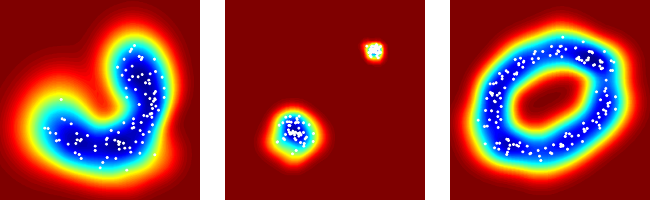

Stochastic Outlier Selection
============================

Stochastic Outlier Selection (SOS) is an unsupervised outlier selection algorithm. It uses the concept of affinity to compute  an outlier probability for each data point.



For more information about SOS, see the technical report: J.H.M. Janssens, F. Huszar, E.O. Postma, and H.J. van den Herik. [Stochastic Outlier Selection](https://github.com/jeroenjanssens/sos/blob/master/doc/sos-ticc-tr-2012-001.pdf?raw=true). Technical Report TiCC TR 2012-001, Tilburg University, Tilburg, the Netherlands, 2012.


Selecting outliers from the command-line
----------------------------------------

A Python implementation of the SOS algorithm can be found in the bin directory. This implementation only depends on NumPy and can be used from the command-line. For example, if we apply SOS with a perplexity of 20 to the Iris dataset, which is included, we obtain the following outlier probabilities:

```bash
git clone https://github.com/jeroenjanssens/sos.git 
cd sos/bin
< iris.csv ./sos -p 20 | sort -nr | head
0.97848576
0.95493157
0.93740898
0.87501047
0.83656144
0.82453133
0.79702956
0.79482970
0.75118016
0.74424569
```

Adding a threshold causes SOS to output 0s and 1s instead of outlier probabilities. If we set the threshold to 0.75 then we see that out of the 150 data points, 9 are selected as outliers:

```bash
< iris.csv ./sos -p 20 -t 0.75 | paste -sd+ | bc
9
```

Under the hood, SOS simply needs a two-dimensional NumPy array. A PyPI package is in the making.

License
-------

All software in this repository is distributed under the terms of the BSD Simplified License. The full license is in the LICENSE file.
